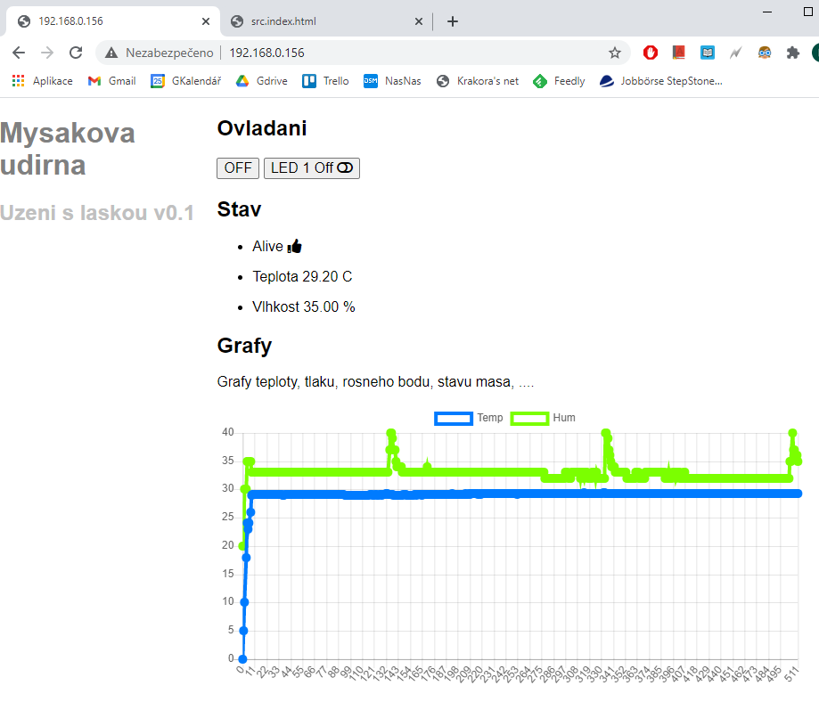

# Myšákova udírna v0.1

Happy Wemose :)

## U stromku

* Zapoj Wemos modul USB do libovolného PC
* Chvilku počkej
* Otevři mobil a koukni na https://192.168.0.156 

## Doma

Naklonuj tento repositář

Instaluj IDE

* Arduino IDE - https://www.microsoft.com/cs-cz/p/arduino-ide/9nblggh4rsd8?ocid=badge&rtc=1&activetab=pivot:overviewtab
* MS Visual Studio Code - https://code.visualstudio.com/download
* MS VSCode extensions 
  * Ardiuino support https://marketplace.visualstudio.com/items?itemName=vsciot-vscode.vscode-arduino
  * PlatformIO https://marketplace.visualstudio.com/items?itemName=platformio.platformio-ide

Začni na

* https://blog.laskarduino.cz/zaciname-s-wemos-d1-mini-s-wifi-modulem-esp8266/

Vem do ruky pájku. 

Hardware k dispozici:

* LasKKit IoT MINI Starter Kit (WeMos D1 mini ESP8266 WiFi modul, WeMos D1 mini DHT11 shield + USB)
* Modul převodníku pro termočlánek PT100, MAX31865, SPI
* PT100 platinový teplotní senzor 0.5m, 3 vodiče
* Wemos D1 mini 1-kanál relé shield
* WeMos D1 mini 64X48 OLED displej shield
* WeMos D1 mini dual base shield

## Hints

### DHT teplotni sensor D4

Teplotni sensor DHT11 je na D4. Viz https://www.laskarduino.cz/wemos-d1-mini-dht11-shield/ resp http://www.esp8266learning.com/wemos-dh11-shield-example.php

### Releový modul D1

Releový modul využívá pin D1, který je ale současně používaný pro I2C komunikaci s displayem. 
Řešení je buď

* Přetypovat dle https://github.com/xoseperez/espurna/issues/420
* Přepájet dle https://sharedinventions.com/?p=670

### Round-robin, Ring buffer

* https://github.com/Locoduino/RingBuffer

### GUI

#### Blynk řešení

* https://blynk.io/
* https://community.blynk.cc/t/wemos-lolin-esp8266-and-relay-misbehaving/34147/2

#### Web stranka s podporou AJAX

* https://circuits4you.com/2018/02/04/esp8266-ajax-update-part-of-web-page-without-refreshing/
* https://circuits4you.com/2019/01/11/esp8266-data-logging-with-real-time-graphs/

### Kdyby náhodou - Jak to vypadá

Web rozhranní které Wemos právě hostuje

